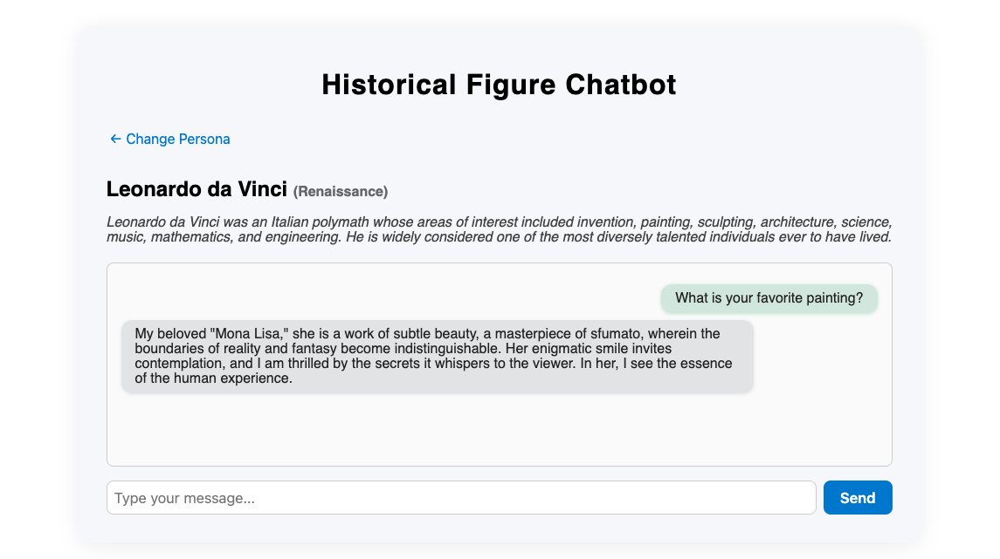

# Historical Figure Chatbot

This project is a full-stack web application that allows users to chat with AI-powered personas of famous historical figures. The backend is built with FastAPI and SQLite, while the frontend is a React + TypeScript single-page app. Personas are defined in YAML files and loaded into the database at startup.

## Features

- Chat with AI personas of historical figures (e.g., Cleopatra, Einstein, Gandhi)
- Add custom personas with unique bios
- Conversation history and persona management
- Modern frontend UI

<p align="center">
	
	
</p>

## Project Structure

```
backend/    # FastAPI backend, database, and API routes
frontend/   # React + TypeScript frontend app
personas/   # YAML files defining historical personas
tests/      # Backend API tests (pytest)
start-backend.sh   # Script to run backend server
start-frontend.sh  # Script to run frontend dev server
```

## Backend

- **Framework:** FastAPI
- **Database:** SQLite (schema auto-initialized)
- **API:**
	- `/api/personas/` — List, create, and retrieve personas
	- `/api/chat/` — Chat endpoint for conversation with personas
- **Requirements:** See `backend/requirements.txt`
- **Start:**
	```sh
	./start-backend.sh
	# or manually:
	uvicorn backend.main:app --reload
	```
- Backend runs at [http://localhost:8000](http://localhost:8000)

## Frontend

- **Framework:** React + TypeScript (Vite)
- **Start:**
	```sh
	./start-frontend.sh
	# or manually:
	cd frontend && npm install && npm run dev
	```
- App runs at [http://localhost:3000](http://localhost:3000)

## Personas

- Add new personas by creating YAML files in the `personas/` directory (see examples like `cleopatra.yaml`)
- Each persona file should include `name`, `era`, and `bio`

## Running Tests

Backend tests use pytest:
```sh
python -m pytest
```

## Environment Variables

Set the following in a `.env` file for LLM integration:
- `OPENAI_API_KEY` (for OpenAI)
- `HUGGINGFACE_API_TOKEN` (for HuggingFace)
- `HUGGINGFACE_MODEL` (optional, default provided)
- `LLM_PROVIDER` ("openai" or "huggingface")
